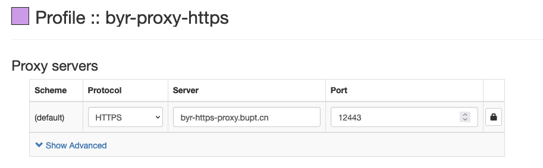
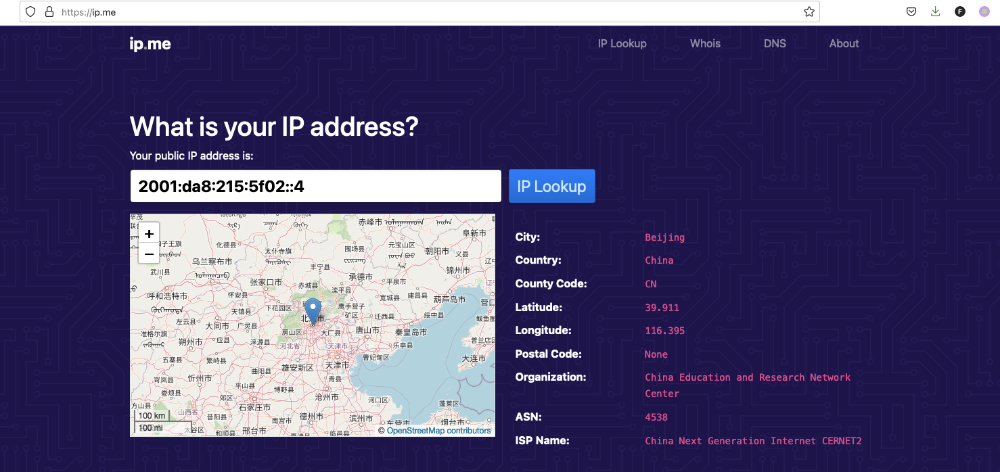

# BYR HTTPS Proxy

A simple https proxy for BYR with authentication.

## How to use

username and password are credentials from netaccount.bupt.edu.cn.

### Bash curl

1. 

```
HTTPS_PROXY='https://<username>:<password>@byr-https-proxy.bupt.cn:12443' curl https://ip.me
```

2. 

```
curl -x 'https://<username>:<password>@byr-https-proxy.bupt.cn:12443' https://ip.me
```

### SwitchyOmega

Config



Proof of work

